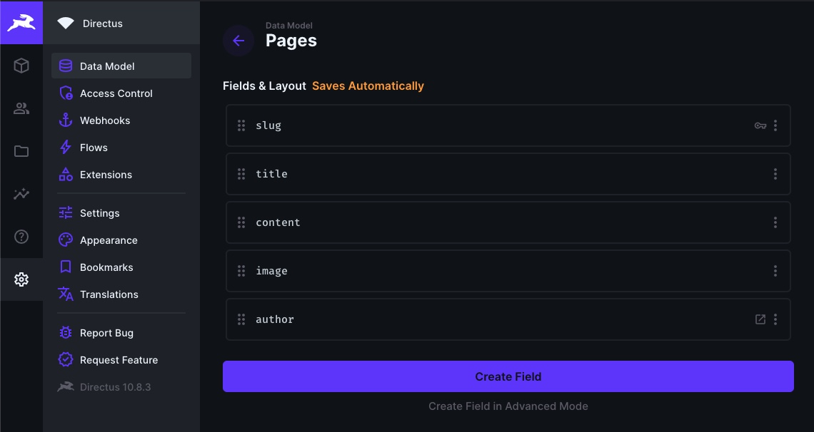
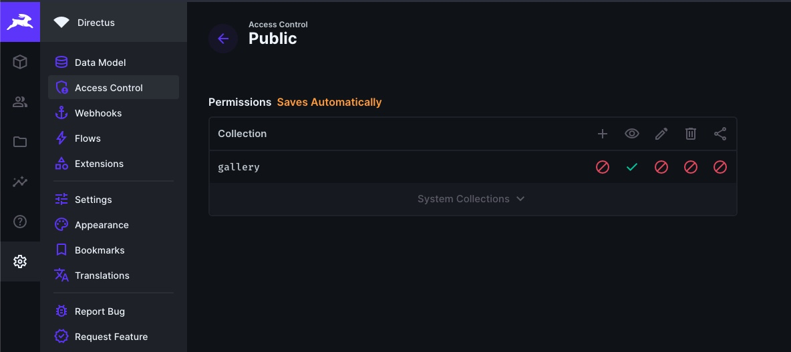
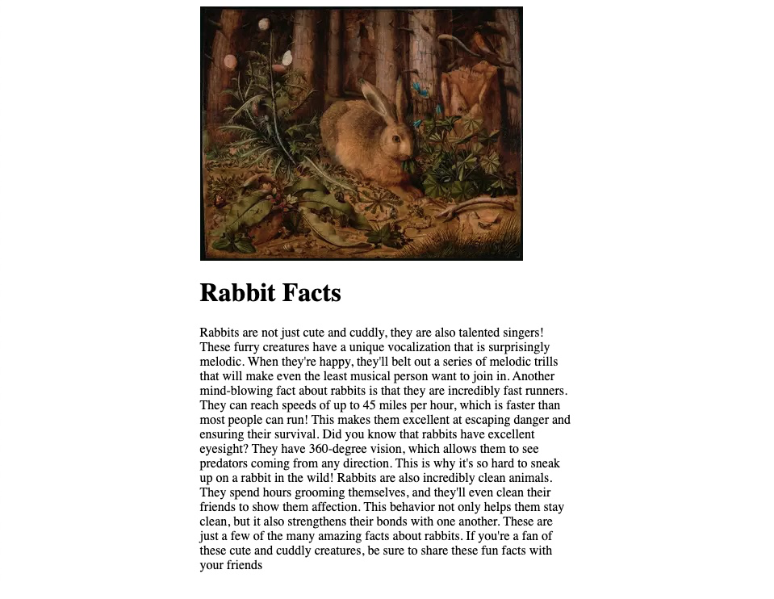

## Introduction

In this blog post, we will create a static website using Gatsby and Directus as a Headless CMS.

We'll make use of the official Directus Gatsby plugin which leverages into one of Gatsby's best features - image compression.

## Before You Start

You will need:

- Node.js and a code editor installed.
- A Directus project - [follow the quickstart guide](https://docs.directus.io/getting-started/quickstart) to create one.
- Knowledge of Gatsby and React.

## Setup

Create a new Gatsby project on your terminal and walk through the wizard:

```sh
npm init gatsby

What would you like to call your site?
  › Directus Gatsby Blog
What would you like to name the folder where your site will be created?
  › directus-gatsby-blog
Will you be using JavaScript or TypeScript?
  › JavaScript
Will you be using a CMS?
  › No (or I'll add it later)
Would you like to install a styling system?
  › No (or I'll add it later)
Would you like to install additional features with other plugins?
  › Done
Add the Google gtag script for e.g. Google Analytics
  › Done
Shall we do this? (Y/n)
  › Yes
```

Navigate into the new directory and install dependencies:

```sh
cd directus-gatsby-blog
npm install @directus/gatsby-source-directus
npm install gatsby-plugin-image gatsby-transformer-sharp gatsby-plugin-sharp
```

Start the development server

```sh
npm run develop
```

Your website is live at `http://localhost:8000/`

## Add Directus Content

Create a Directus collection named page, and make the Primary ID Field a `Manually Entered String` called `slug`.

Then add the following fields:

- title (string)
- content (either WISIWYG or Markdown)
- image (image)





Do not forget to add the read permission to the `directus_files` collection (you have to clikc on "System Collections").


## Creating Pages With the Directus Plugin

### Configuring the Plugin

This will make each item in your collection into its own page on your Gatsby site.

Directus maintains an official plugin for Gatsby. That plugin turns your Directus content is turned into Gatsby source nodes. You can query these nodes everywhere in your Gatsby site, using the GraphQL API, just like you would with Markdown files.

Now, we can instruct Gatsby to build a static page for each entry in our `pages` collection.

First, you need to add and configure the Directus plugin and the other Gatsby plugins that act as dependencies. Update your `gatsby-config.js` file as follows:

```js
module.exports = {
  siteMetadata: {
    title: `Directus Gatsby Blog`,
    siteUrl: `https://www.yourdomain.com`,
  },
  plugins: [
    "gatsby-plugin-image",
    "gatsby-plugin-sharp",
    "gatsby-transformer-sharp",
    {
      resolve: "@directus/gatsby-source-directus",
      options: {
        // Your project's URL
        url: "[DIRECTUS_PROJECT_URL]",
        auth: {
          // Use the credentials that you received by email
          // when you created your project, or a user's
          email: "[YOUR_EMAIL]",
          password: "[YOUR_PASSWORD]",
        },
      },
    },
  ],
};
```

Now our plugins are configured. We can move to on to creating the individual pages.

### Creating a Template File

First, we need to create a Gatsby template, this component determines what each page will look like.

Create the template in `./src/templates/blog.js`, we will need to reference this file's path in the next section.

Populate it with the following:

```jsx
import React from "react";
import { GatsbyImage, getImage } from "gatsby-plugin-image";

const BlogTemplate = ({ pageContext }) => {
  const { page } = pageContext;
  const image = getImage(page.image.imageFile);

  return (
    <div style={{ margin: "0 auto", maxWidth: "58ch" }}>
      <GatsbyImage image={image} alt={page.title} />
      <h1>{page.title}</h1>
      <section>{page.content}</section>
    </div>
  );
};

export default BlogTemplate;
```

In the template, we're expecting each item in our Directus collection to be passed as a `page` object via the `pageContext` property. We'll set this up now.

A the root of your project directory, create a `gatsby-node.mjs` file (note the `.mjs`).

Populate it with the following:

```jsx
import path from "path";

export const createPages = async ({ graphql, actions: { createPage } }) => {
  const result = await graphql(`
    {
      directus {
        pages {
          title
          content
          slug
          image {
            id
            imageFile {
              childImageSharp {
                gatsbyImageData(width: 400)
              }
            }
          }
        }
      }
    }
  `);

  result.data.directus.pages.forEach((page) => {
    createPage({
      path: `/blog/${page.slug}`,
      component: path.resolve(`./src/templates/blog.js`),
      context: {
        page,
      },
    });
  });
};
```

::: tip Getting a GraphQL error with `imageFile`?
You might have forgotten to also give the `directus_files` collection read access.
This is due to that by default the file object only includes the image name, but not the actual binary file from the Directus endpoint. To fix this refer to the screenshot in the second section of this article.
:::

If you navigate to the slug of one your pages, like
`/blog/rabbit-facts`, you will see your template file rendered.



## Creating an Index

Next, we want to create an index page that shows you all the items in our collection. We created individual pages for each item using the official plugin, which also made Gatsby nodes for us.

We can use the GraphQL API to query these nodes and list everything in our index page.

First, delete all the styles that were created by `npm init`, then replace the content with the following:

```jsx
import React from "react";
import { graphql, Link } from "gatsby";
import { GatsbyImage, getImage } from "gatsby-plugin-image";

const IndexPage = ({ data }) => {
  const pages = data.directus.pages;

  return (
    <main>
      <h1>All Pages</h1>
      {pages.map((page) => {
        const image = getImage(page.image.imageFile);
        return (
          <article key={page.slug}>
            <GatsbyImage image={image} alt={page.title} />
            <h2>{page.title}</h2>
            <Link to={`/blog/${page.slug}`}>Read More</Link>
            <hr />
          </article>
        );
      })}
    </main>
  );
};

export const query = graphql`
  {
    directus {
      pages {
        title
        content
        slug
        image {
          id
          imageFile {
            childImageSharp {
              gatsbyImageData(width: 300)
            }
          }
        }
      }
    }
  }
`;

export default IndexPage;

export const Head = () => <title>Home Page</title>;
```

## Summary

You've learned:

- How to use the official Directus plugin to transform your content into source nodes
- How to create static pages for each item in a Directus collection.
- How to query your Directus content with Gatsby's GraphQL API.
- How to put take your Directus remote images and optimize them with Gatsby's image processing pipeline.
